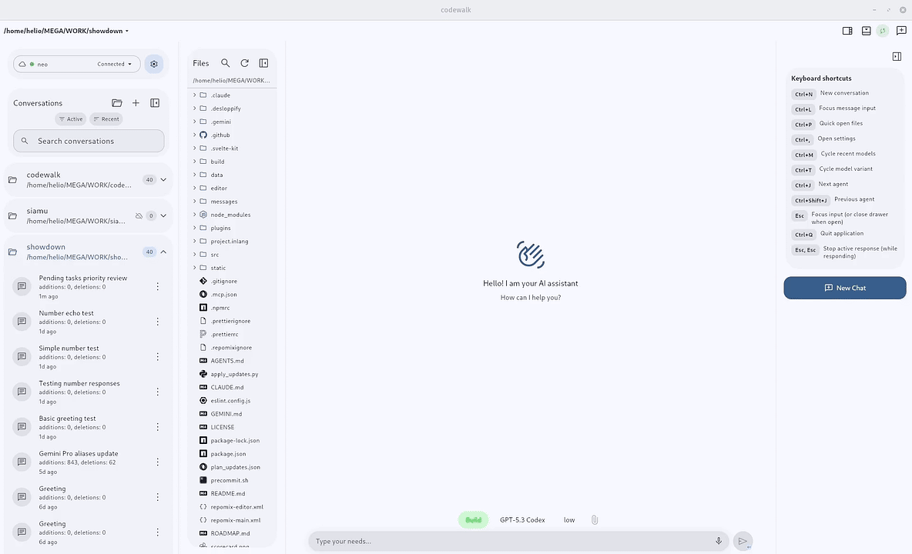

# CodeWalk

<p align="center"></p>
<p align="center">https://github.com/user-attachments/assets/032f64e2-e8ee-4024-b49a-ca95a774653f</p>


A native (really fast!!) cross-platform client for [OpenCode](https://github.com/anomalyco/opencode) server mode. Built with Flutter, it provides a conversational interface for session-based AI coding interactions over HTTP APIs and streaming events.

## Unique Features

🎙 Speech-to-text on every platform, including Linux
💬 Canned answers for faster replies
↩️ Easier undo and redo
🧙 OpenCode setup wizard

## Highlights

- Realtime AI chat with streaming responses (SSE) and robust turn reconciliation
- Queued `Send now` handoff without false abort error noise or duplicate chat bubbles
- Instant session reopen with SWR snapshots and background revalidation
- Load older message history by scrolling to the top of chat
- Project-centric sidebar with conversations grouped by open projects
- Context-scoped conversation pinning to keep priority sessions at top
- Canned answers with global/project scope
- Project context support for both Git repositories and non-Git folders
- Per-project New Chat draft isolation with lazy session bootstrap
- Multi-server profile management (health checks, default/active switching, auth)
- Install and Run OpenCode Server directly from Settings
- Model/provider selection with variants, favorites, and reasoning controls
- In-app update flow with auto-check, startup notification, and direct install
- Physical-keyboard productivity shortcuts, including Alt+Tab-style session cycling
- Mobile external-keyboard send keeps composer focus for rapid follow-up input
- Interactive server permission/question prompts with attention badges
- Responsive Material 3 experience across Linux, Windows, macOS, Web, and Android

## Install in One Command

Install using the `install.cat` pattern:

- Linux & macOS

  ```bash
  curl -fsSL install.cat/verseles/codewalk | sh
  ```

- Windows (PowerShell)

  ```powershell
  irm install.cat/verseles/codewalk | iex
  ```

Run the same command again any time to update/reinstall to the latest GitHub release.

Installers automatically pick the right release for your platform.

- Android

  Open this in your Android browser to download the APK:
  [install.cat/verseles/codewalk](https://install.cat/verseles/codewalk)

### Uninstall

- Linux & macOS

  ```bash
  curl -fsSL https://raw.githubusercontent.com/verseles/codewalk/main/uninstall.sh | sh
  ```

- Windows (PowerShell)

  ```powershell
  irm https://raw.githubusercontent.com/verseles/codewalk/main/uninstall.ps1 | iex
  ```

## Getting Started

### Prerequisites

- Flutter SDK (>=3.8.1)
- Dart SDK
- An OpenCode-compatible server instance
- Platform toolchain for your target:
  - Linux desktop: `clang`, `cmake`, `ninja`, `pkg-config`
  - Windows desktop: build from a Windows host
  - macOS desktop: build from a macOS host

### Setup

1. Install dependencies:

   ```bash
   flutter pub get
   ```

2. Run the app (examples):

   ```bash
   flutter run -d linux
   flutter run -d chrome
   flutter run -d android
   ```

3. Build artifacts (examples):
   ```bash
   flutter build linux
   flutter build web
   ```

### Make Targets

```bash
make check      # deps + codegen + analyze + test
make check-fast # deps + codegen + analyze + test-fast
make test-fast  # excludes slow/integration tags
make android    # build arm64 APK
make precommit  # check + android
```

### Server Configuration

1. Launch the app and open **Settings** from the sidebar
2. Tap **Add Server** and run the Quick setup command in your terminal
3. Keep the default `Server URL` (`http://127.0.0.1:4096`) or set your server URL
4. Configure Basic Auth only if your server requires it
5. Save and switch active/default profiles as needed

## Architecture

The project follows Clean Architecture with three layers: Domain, Data, and Presentation. Dependency injection via `get_it`, HTTP via `dio`, state management via `provider`.

For full technical details, see [CODEBASE.md](CODEBASE.md).

## Tech Stack

- **Framework:** Flutter
- **Language:** Dart
- **State Management:** Provider
- **HTTP Client:** Dio
- **Local Storage:** SharedPreferences
- **Dependency Injection:** GetIt
- **Design System:** Material Design 3

## License

This project is dual-licensed:

- **Open Source:** [GNU Affero General Public License v3.0 (AGPLv3)](LICENSE) -- free for everyone.
- **Commercial:** A [separate commercial license](LICENSE-COMMERCIAL.md) is available for organizations with annual revenue exceeding USD 1M that wish to use the software without AGPLv3 obligations.

## Origin and Acknowledgment

CodeWalk is a fork of [OpenMode](https://github.com/easychen/openMode), originally created by [easychen](https://github.com/easychen). The original project is licensed under MIT.

Substantial modifications have been made since the fork, including licensing changes, code restructuring, rebranding, full English standardization, and documentation rewrites. All modifications are licensed under AGPLv3 (or the commercial license, where applicable).

See [NOTICE](NOTICE) for full attribution details.
